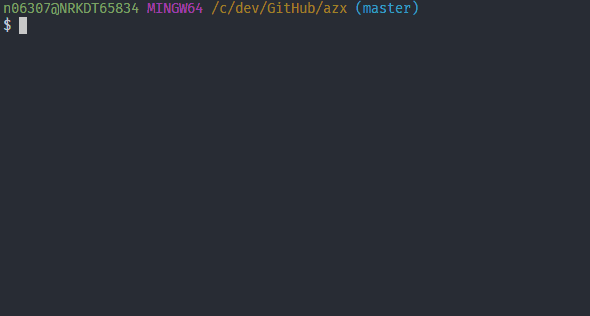

[](https://www.npmjs.com/package/azx) [](https://tolu.mit-license.org/)


# azx
Interactive cli helper for Azure CLI 2

Implements interactive flows for selecting data (just `show-tags` right now)


You'll need to have [`az`](https://docs.microsoft.com/en-us/cli/azure/install-azure-cli?view=azure-cli-latest) installed in path

> There are som issues that needs to be solved here on windows  
> where I have to set the command to the absolute path...

## Install

```
$ npm i -g azx
```

## Usage

```
$ azx -h

  Usage: azx [command] [options]

  Interactive <az> helper

  Options:

    -v, --version       output the version number
    -h, --help          output usage information

  Commands:

    set-subscription|s  select az subscription
    get-tags|gt         list tags for image in acr
    interactive|i       select from available commands interactively
```

### What it looks like
Select subscription  


List tags in acr repository  



## Dependencies

 - [commander](https://www.npmjs.com/package/commander) - solution for building node.js cli
 - [inquirer](https://www.npmjs.com/package/inquirer) - interactive cli prompts
 - [clui](https://www.npmjs.com/package/clui) - cli spinner
 - [execa](https://www.npmjs.com/package/execa) - a better `child_process`
 - [semver-sort](https://www.npmjs.com/package/semver-sort) - for sorting image tags

## Inspiration

 - https://www.sitepoint.com/javascript-command-line-interface-cli-node-js/
 - https://scotch.io/tutorials/build-an-interactive-command-line-application-with-nodejs

## License

MIT @ https://tolu.mit-license.org/
